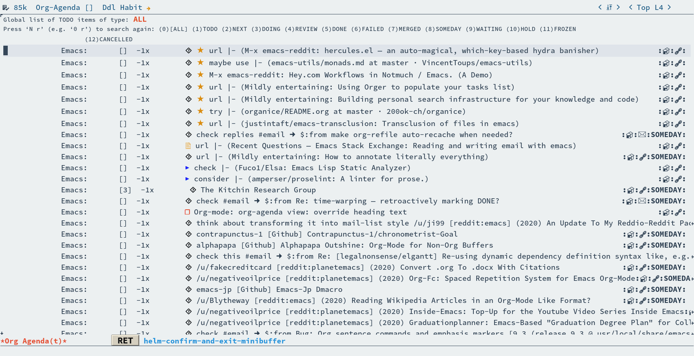

# Table of Contents

1.  [Visual demos for Org mode for Emacs](#orgc0f2d30)
    1.  [Refiling](#orgf8ad2cf)
        1.  [Refiling multiple headings using agenda bulk actions](#org2439d6e)

# Visual demos for [Org mode for Emacs](https://orgmode.org/)

## Refiling

### Refiling multiple headings using agenda bulk actions

